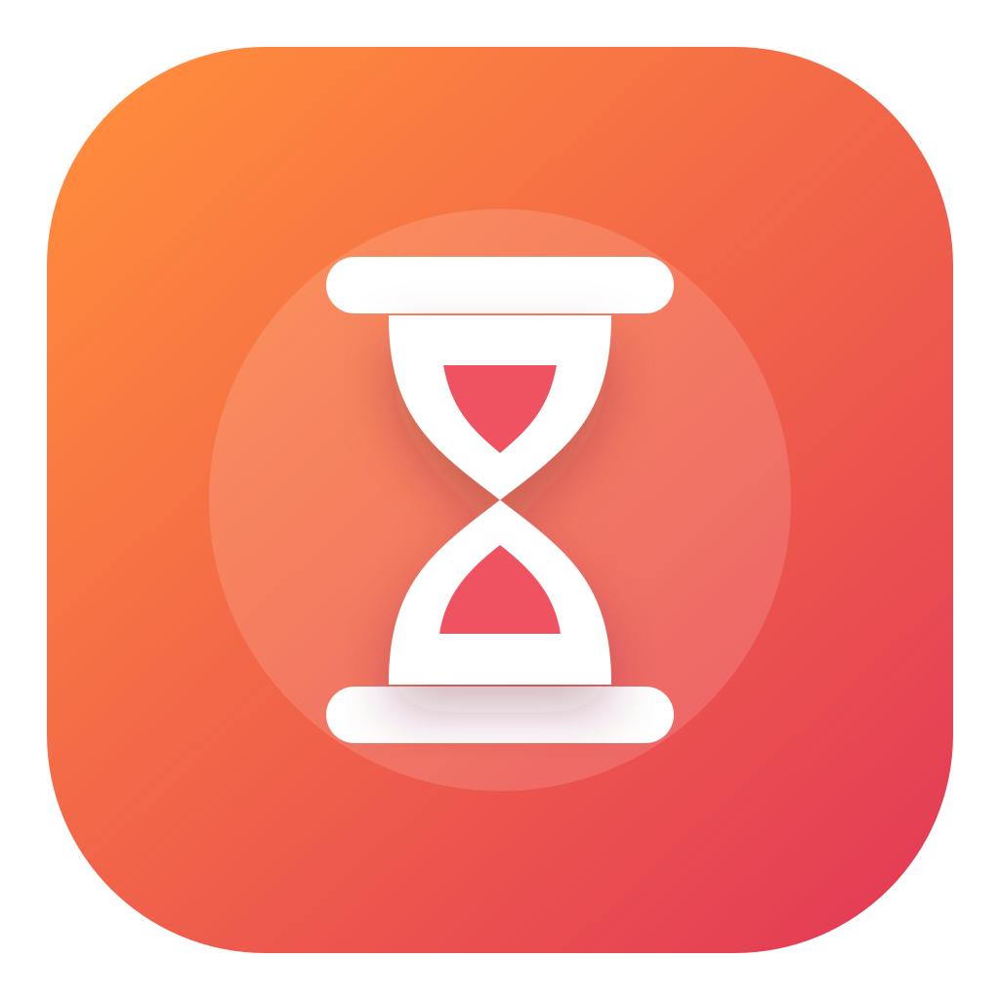

  

<h1 align="center">TimenBar</h1>

TimenBar is an unofficial, native macOS menu-bar client for [Timen](https://www.gettimen.com). It tracks live time, keeps a read-only local cache, detects idle time without Accessibility permission, and connects only through Timen's documented OAuth-enabled MCP endpoint.

TimenBar is independent software and is not affiliated with or endorsed by Timen.

See [docs/architecture.md](docs/architecture.md), [docs/releasing.md](docs/releasing.md), [PRIVACY.md](PRIVACY.md), and [SECURITY.md](SECURITY.md).

## License

MIT. See [LICENSE](LICENSE).
